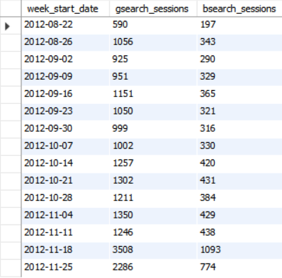

### Analysis for Channel Portfolio Management
	
    Understanding which marketing channels are driving the most sessions and orders through the website

    Understanding the difference in user charateristic and conversion performance accross marketing channels

    Optimizing bids and allocating marketing spend accross multi-channel portfolio to achieve maximum performance
        
**Key tables:**  website_sessions and orders 


#### Analyzing Channel Portfolio

Launched a second paid search channel `bsearch` around Aug 22,2012. Retrieve weekly trended sessions volume since Nov 29,2012 and compare to `gsearch``nonbrand`

```sql
select 
	min(date(created_at)) as week_start_date,
    count(case when utm_source = 'gsearch' then website_session_id else null end) as gsearch_sessions,
    count(case when utm_source = 'bsearch' then website_session_id else null end) as bsearch_sessions
from website_sessions
where created_at between '2012-08-22' and '2012-11-29'  -- arbitrary
	and utm_campaign = 'nonbrand'
group by yearweek(created_at);
```

`bsearch` tends to get roughly a third the traffic of `gsearch`

#### Comparing Channel Characteristics

Percentage of traffic comming on `Mobile` for `nonbrand` `bsearch`, and compare that to `gsearch`

```sql
select
	utm_source,
    count(distinct website_session_id) as sessions,
    count(case when device_type = 'mobile' then website_session_id else null end) as mobile_sessions,
    round(count(case when device_type = 'mobile' then website_session_id else null end) /count(distinct website_session_id) * 100.0 ,2) as pct_mobile
from website_sessions
where created_at between '2012-08-22' and '2012-11-30'  -- arbitrary
	and utm_campaign = 'nonbrand'
group by 1;
``` 
    
 
#### Cross Channel Bid Optimization

Should I spend on `bsearch``nonbrand` bids as `gsearch`. Find a conversion rates from session to order for `gsearch` `bsearch`, slice the data by device type 

```sql
select 
	website_sessions.device_type as Device,
    website_sessions.utm_source as Channel,
    count(distinct website_sessions.website_session_id) as Sessions,
    count(distinct orders.order_id) as Orders,
    count(distinct orders.order_id) / count(distinct website_sessions.website_session_id) as CVR
from website_sessions left join orders 
	on website_sessions.website_session_id = orders.website_session_id
where website_sessions.utm_campaign = 'nonbrand'
	and website_sessions.created_at between '2012-08-22' and '2012-09-18'
group by 1,2;
```

the channels don't perform identical, so we should differentiate our bids in order to optimize our overall paid marketing budget

#### Impact of Bid Changes

Based on last analysis, bid down `bsearch` `nonbrand` on Dec 2, 2012. Retrieve weekly session 'trend' volume for `gsearch` and `bsearch` `nonbrand`, broken down by device since Nov 4, 2012 to Dec 22, 2012. Also include a comparison to show `bsearch` as a percent of `gsearch` for each device

```sql
select
	min(date(created_at)) as week_start_date,
	count(case when utm_source = 'gsearch' and device_type = 'desktop' then website_session_id else null end) as g_desktop_sessions,
    count(case when utm_source = 'bsearch' and device_type = 'desktop' then website_session_id else null end) as b_desktop_sessions,
    round(count(case when utm_source = 'bsearch' and device_type = 'desktop' then website_session_id else null end) 
    / count(case when utm_source = 'gsearch' and device_type = 'desktop' then website_session_id else null end)*100.0,2) as b_pct_of_g_desktop,
    count(case when utm_source = 'gsearch' and device_type = 'mobile' then website_session_id else null end) as g_mobile_sessions,
    count(case when utm_source = 'bsearch' and device_type = 'mobile' then website_session_id else null end) as b_mobile_sessions,
    round(count(case when utm_source = 'bsearch' and device_type = 'mobile' then website_session_id else null end)
    / count(case when utm_source = 'gsearch' and device_type = 'mobile' then website_session_id else null end)*100.0,2) as b_pct_of_g_mobile
from website_sessions
where utm_campaign = 'nonbrand'
	and created_at between '2012-11-04' and '2012-12-22'
group by yearweek(created_at);
```

`bsearch` traffic dropped off a bit after the bid down

#### Analyzing Free Channels

**We need to konw if there are moumentum with our brand or if we will need to keep relying on paid traffic** 

Organic search, direct type in, and paid brand search sessions by month, and show those sessions as a % of paid search `nonbrand`

```sql
select
	year(created_at) as Year,
    month(created_at) as Month,
    count(case when utm_campaign = 'nonbrand' then website_session_id else null end) as nonbrand,
    count(case when utm_campaign = 'brand' then website_session_id else null end) as brand,
    round(count(case when utm_campaign = 'brand' then website_session_id else null end) 
    / count(case when utm_campaign = 'nonbrand' then website_session_id else null end)*100.0,2) as brand_pct_of_nonbrand,
    count(case when http_referer is null and utm_source is null then website_session_id else null end) as direct_type_in,
    round(count(case when http_referer is null and utm_source is null then website_session_id else null end)
    / count(case when utm_campaign = 'nonbrand' then website_session_id else null end)*100.0,2) as direct_pct_of_nonbrand,
    count(case when http_referer is not null and utm_source is null then website_session_id else null end) as organic,
    round(count(case when http_referer is not null and utm_source is null then website_session_id else null end)
    / count(case when utm_campaign = 'nonbrand' then website_session_id else null end)*100.0,2) as organic_pct_of_nonbrand
from website_sessions
where created_at < '2012-12-23'
group by 1,2;
```

Not only our brand, direct and organic growing, but they are growing as a percentage of our paid traffic volume
    
    
    
    