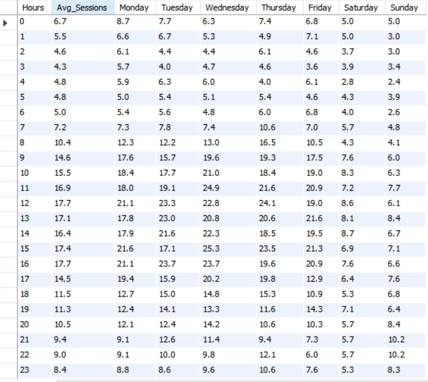

### Analyzing Business Patterns and Seasonality

**Key Table:** website_sessions and orders

#### Understanding Seasonality

Session and Order volume in 2012's monthly and weekly patterns, to see if we can find any seasonal trends we should plan for in 2013 
```sql
select 
	year(website_sessions.created_at) as Year,
    month(website_sessions.created_at) as Monthly,
    count(distinct website_sessions.website_session_id) as Sessions,
    count(distinct orders.order_id) as Orders
from website_sessions left join orders
	on website_sessions.website_session_id = orders.website_session_id
where year(website_sessions.created_at) = 2012
group by 1,2;
```


```sql
select 
	min(date(website_sessions.created_at)) as start_week_date,
    count(distinct website_sessions.website_session_id) as Sessions,
    count(distinct orders.order_id) as Orders
from website_sessions left join orders
	on website_sessions.website_session_id = orders.website_session_id
where year(website_sessions.created_at) = 2012
group by yearweek(website_sessions.created_at);
```


We grew steadily all year, Significant volume around the holiday months(especially the weeks of the black friday) 

We wanna keep this in mind in 2013 as we think about customer support and inventory management


#### Analyzing Business Patterns

we need to find the peak of sessions hourly per day. We're considering adding a live chat support to the website to improve our customers experience  

```sql
select
	Hours,
    round(avg(sessions),1) as Avg_Sessions,
    round(avg(case when w_day = 0 then sessions else null end),1) as Monday,
    round(avg(case when w_day = 1 then sessions else null end),1) as Tuesday,
    round(avg(case when w_day = 2 then sessions else null end),1) as Wednesday,
    round(avg(case when w_day = 3 then sessions else null end),1) as Thursday,
    round(avg(case when w_day = 4 then sessions else null end),1) as Friday,
    round(avg(case when w_day = 5 then sessions else null end),1) as Saturday,
    round(avg(case when w_day = 6 then sessions else null end),1) as Sunday
from (
	select 
		date(created_at) created_date,
        weekday(created_at) w_day,
        hour(created_at) Hours,
		count(distinct website_session_id) as sessions
	from website_sessions 
	where created_at between '2012-09-15' and '2012-11-15' 
	group by 1,2,3
) daily_hourly_sessions
group by 1
order by 1 asc;
```


We found that plan on one support staff around the clock and then doubled up two staff members from 8am to 5pm Monday through Friday
