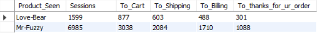

#### Product Sales Analysis

We will launch a new product, Need a deep dive on our current product

Monthly trends to date for number of sales, total revenue and total margins generated 
```sql
SELECT 
    YEAR(created_at) AS Year,
    MONTH(created_at) AS Month,
    COUNT(order_id) AS Sales,
    ROUND(SUM(price_usd),1) as Revenue,
    ROUND(SUM(price_usd - cogs_usd),1) AS Margin
FROM mavendb.orders
WHERE created_at < '2013-01-04' -- Arbitrary
GROUP BY 1,2;
```

Our revenue and margain are grew steadily increasing all year


#### Product Launch Sales Analysis

We have launched our second product back on Jan 6th

Monthly order volume, overall conversion rate, revenue per session and a breakdown of sales by product all the time period since April 1th, 2012 
```sql
SELECT
    YEAR(S.created_at) AS Year,
    MONTH(S.created_at) AS Month,
    COUNT(DISTINCT S.website_session_id) AS Sessions,
    COUNT(DISTINCT O.order_id) AS Orders,
    COUNT(DISTINCT O.order_id) / COUNT(DISTINCT S.website_session_id) AS CVR,
    ROUND(SUM(O.price_usd) / COUNT(DISTINCT S.website_session_id),1) AS Revenue_Per_Session,
    COUNT(CASE WHEN O.primary_product_id = 1 THEN O.order_id ELSE NULL END) AS 1st_Product,
    COUNT(CASE WHEN O.primary_product_id = 2 THEN O.order_id ELSE NULL END) AS 2nd_Product
FROM website_sessions S LEFT JOIN  orders O
    ON S.website_session_id = O.website_session_id
WHERE S.created_at BETWEEN '2012-04-01' AND '2013-04-01' -- Arbitrary
GROUP BY 1,2;
```

CVR and Revenu per session are improving over time


#### Product Level Website Analysis

View to Order CVR
```sql 
SELECT 
    pageview_url AS Product,
    COUNT(DISTINCT website_page_views.website_session_id) AS Sessions,
    COUNT(DISTINCT orders.order_id) AS Orders,
    COUNT(DISTINCT orders.order_id) / COUNT(DISTINCT website_page_views.website_session_id) AS CVR
FROM website_page_views  LEFT JOIN orders
    on orders.website_session_id = website_page_views.website_session_id
WHERE website_page_views.created_at BETWEEN '2013-02-01' AND '2013-03-01'   
    AND pageview_url IN ('/the-forever-love-bear','/the-original-mr-fuzzy')
GROUP BY 1;
```


#### Product Pathing Analysis

Sessions which hit `/products` page and see where they went next

Click through rate from `/products` since the new product lanuch on in Jan 6th, 2013 by product, and compare to the 3 months leading up to launch
```sql
-- Find the relevant '/products' pageview with website session id
CREATE TEMPORARY TABLE ProoductViewLevels
WITH products_page AS(
	SELECT 
		website_session_id, 
		website_pageview_id,
		CASE 
			WHEN created_at < '2013-01-06' THEN 'A. Pre_Product_2'
			WHEN created_at >= '2013-01-06' THEN 'B. Post_Product_2'
			ELSE  NULL
		END AS Time_Period
	FROM website_page_views
	WHERE created_at BETWEEN '2012-10-06' AND '2013-04-06'
		AND pageview_url = '/products')
-- Find the next pageview id that occurs after the product pageview id 
SELECT 
	products_page.Time_Period,
    products_page.website_session_id,
    MIN(website_page_views.website_pageview_id) AS Min_Next_PageView_id
FROM products_page LEFT JOIN website_page_views
	ON products_page.website_session_id = website_page_views.website_session_id
    AND website_page_views.website_pageview_id > products_page.website_pageview_id
GROUP BY 1,2;
```
```sql
-- Find the pageview_url assoicated with any applicable next pageview id
CREATE TEMPORARY TABLE Sessions_With_Next_Page_View_URL
SELECT 
    ProoductViewLevels.Time_Period,
    ProoductViewLevels.website_session_id,
    website_page_views.pageview_url AS Next_PageView_URL
FROM ProoductViewLevels LEFT JOIN website_page_views
    ON ProoductViewLevels.Min_Next_PageView_id = website_page_views.website_pageview_id;
```
```sql
-- Summarize data and analyze Pre and Post periods
SELECT 
    Time_Period,
    COUNT(DISTINCT website_session_id) AS Sessions,
    COUNT(CASE WHEN Next_PageView_URL IS NOT NULL THEN website_session_id ELSE  NULL END) AS to_Next_Page,
    COUNT(CASE WHEN Next_PageView_URL IS NOT NULL THEN website_session_id ELSE  NULL END) / COUNT(DISTINCT website_session_id) AS Pct_to_Next_Page,
    COUNT(CASE WHEN Next_PageView_URL = '/the-original-mr-fuzzy' THEN website_session_id ELSE  NULL END) AS to_MR_Fuzzy,
    COUNT(CASE WHEN Next_PageView_URL = '/the-original-mr-fuzzy' THEN website_session_id ELSE  NULL END)/COUNT(DISTINCT website_session_id) AS Pct_to_Mr_Fuzzy,
    COUNT(CASE WHEN Next_PageView_URL = '/the-forever-love-bear' THEN website_session_id ELSE  NULL END) AS to_Love_Bear,
    COUNT(CASE WHEN Next_PageView_URL = '/the-forever-love-bear' THEN website_session_id ELSE  NULL END)/COUNT(DISTINCT website_session_id) AS Pct_to_Love_Bear
FROM Sessions_With_Next_Page_View_URL
GROUP BY 1
```

the percent of `/products` pageviwes that clicked to `Mr-Fuzzy` has gone down since the launch of `Love-Bear`, but the ovreall click through rate has gone up.


#### Product Conversion Funnel
```sql
-- select all pageview for relevant sessions 
CREATE TEMPORARY TABLE PageView
    SELECT
        website_session_id,
        website_pageview_id,
        pageview_url AS Product_Name
    FROM website_page_views
    WHERE created_at BETWEEN '2013-01-06' AND '2013-04-10'
        AND pageview_url in ('/the-original-mr-fuzzy','/the-forever-love-bear');
```
```sql   
-- figure out which pageview url to look for ('Cart','Shipping','Biling-2','Thanks For Your Order')
SELECT 
    DISTINCT website_page_views.pageview_url
FROM PageView LEFT JOIN website_page_views 
    ON PageView.website_session_id = website_page_views.website_session_id 
        AND website_page_views.website_pageview_id > PageView.website_pageview_id
```
```sql
-- pull all pageview and identify the funnel steps
SELECT 
    PageView.website_session_id,
    PageView.Product_Name,
    CASE WHEN website_page_views.pageview_url = '/cart' THEN 1 ELSE  0 END AS to_cart,
    CASE WHEN website_page_views.pageview_url = '/shipping' THEN  1 ELSE  0 END AS to_shipping,
    CASE WHEN website_page_views.pageview_url = '/billing-2' THEN  1 ELSE  0 END AS to_billing,
    CASE WHEN website_page_views.pageview_url = '/thank-you-for-your-order' THEN  1  ELSE  0 END AS to_thanks_for_ur_order
FROM PageView LEFT JOIN website_page_views
    ON PageView.website_session_id = website_page_views.website_session_id
        AND website_page_views.website_pageview_id > PageView.website_pageview_id
```
```sql
-- create the session-level conversion funnel view
CREATE TEMPORARY TABLE Session_Level_CVR
SELECT 
    website_session_id,
    CASE 
        WHEN Product_Name = '/the-original-mr-fuzzy' THEN 'Mr-Fuzzy'
        WHEN Product_Name = '/the-forever-love-bear' THEN 'Love-Bear'
        ELSE  'Other'
    END AS Product_Seen,
    MAX(to_cart) AS made_it_cart,
    MAX(to_shipping) AS made_it_shipping,
    MAX(to_billing) AS made_it_billing,
    MAX(to_thanks_for_ur_order) AS made_it_thanks_for_ur_order
FROM
(
    SELECT 
        PageView.website_session_id,
        PageView.Product_Name,
        CASE WHEN website_page_views.pageview_url = '/cart' THEN 1 ELSE  0 END AS to_cart,
        CASE WHEN website_page_views.pageview_url = '/shipping' THEN  1 ELSE  0 END AS to_shipping,
        CASE WHEN website_page_views.pageview_url = '/billing-2' THEN  1 ELSE  0 END AS to_billing,
        CASE WHEN website_page_views.pageview_url = '/thank-you-for-your-order' THEN  1  ELSE  0 END AS to_thanks_for_ur_order
    FROM PageView LEFT JOIN website_page_views
        ON PageView.website_session_id = website_page_views.website_session_id
            AND website_page_views.website_pageview_id > PageView.website_pageview_id
) AS TAB
GROUP BY 1,2;
```
```sql
-- aggregate the data to assess the funnel performance
SELECT
    Product_Seen,
    COUNT(DISTINCT website_session_id) AS Sessions,
    COUNT(CASE WHEN made_it_cart = 1 THEN website_session_id ELSE NULL END) AS To_Cart,
    COUNT(CASE WHEN made_it_shipping = 1 THEN website_session_id ELSE NULL END) AS To_Shipping,
    COUNT(CASE WHEN made_it_billing = 1 THEN website_session_id ELSE NULL END) AS To_Billing,
    COUNT(CASE WHEN made_it_thanks_for_ur_order = 1 THEN website_session_id ELSE NULL END) AS To_thanks_for_ur_order
FROM Session_Level_CVR
GROUP BY 1;
```

```sql
-- Click Through Rate
SELECT
    Product_Seen,
    COUNT(CASE WHEN made_it_cart = 1 THEN website_session_id ELSE NULL END) / COUNT(DISTINCT website_session_id) AS Product_Click_Rate,
    COUNT(CASE WHEN made_it_shipping = 1 THEN website_session_id ELSE NULL END) /  COUNT(CASE WHEN made_it_cart = 1 THEN website_session_id ELSE NULL END) AS Cart_Click_Rate,
    COUNT(CASE WHEN made_it_billing = 1 THEN website_session_id ELSE NULL END) / COUNT(CASE WHEN made_it_shipping = 1 THEN website_session_id ELSE NULL END) AS Shipping_Click_Rate,
    COUNT(CASE WHEN made_it_thanks_for_ur_order = 1 THEN website_session_id ELSE NULL END) / COUNT(CASE WHEN made_it_billing = 1 THEN website_session_id ELSE NULL END) AS Billing_Click_Rate
FROM Session_Level_CVR
GROUP BY 1
```

I had found that adding a second product increased overall click through rate from `/products` page
`Love bear` has a better click rate to the `/cart` page
Seems like the second product was a great addition for our business


#### Cross Sale Analysis

Identify which products users are most likely to purchase together 

Cross sale >>> is_primary_item equals 0
```sql
SELECT
    O.primary_product_id,
    COUNT(DISTINCT O.order_id) AS Orders,
    COUNT(CASE WHEN I.product_id = 1 THEN O.order_id ELSE NULL END) AS Cross_Sell_P1,
    COUNT(CASE WHEN I.product_id = 2 THEN O.order_id ELSE NULL END) AS Cross_Sell_P2,
    COUNT(CASE WHEN I.product_id = 3 THEN O.order_id ELSE NULL END) AS Cross_Sell_P3
FROM orders O LEFT JOIN order_items I 
    ON I.order_id = O.order_id
        AND I.is_primary_item = 0 -- Cross Sales
WHERE O.order_id BETWEEN 10000 AND 11000 -- Arbitrary
GROUP BY 1;
```


On Sep 25, 2013 we started giving a customer optins to add second product while on `/cart` page

Compare the month before and month after this change 

Click through rate from `/cart` page, AOV, revenue per `/cart` page view 
```sql
-- Identify the relevant /cart page views and their sessions 
CREATE TEMPORARY TABLE Cart_Sessions
SELECT 
    website_session_id,
    website_pageview_id,
    CASE 
        WHEN created_at < '2013-09-25' THEN 'Pre_Cross_Sell'  
        WHEN created_at >='2013-09-25' THEN 'Post_Cross_Sell'
        ELSE 'Other'
    END time_period
FROM website_page_views
WHERE pageview_url = '/cart'
    AND created_at BETWEEN '2013-08-25' AND '2013-10-25';
-- Which of those sessions clicked through to `/shipping` page 
CREATE TEMPORARY TABLE Cart_Sessions_To_Another_Page
SELECT
    Cart_Sessions.website_session_id,
    Cart_Sessions.time_period,
    MIN(website_page_views.website_pageview_id) AS min_pageview_id_after_cart
FROM Cart_Sessions LEFT JOIN website_page_views 
    ON Cart_Sessions.website_session_id = website_page_views.website_session_id
        AND website_page_views.website_pageview_id > Cart_Sessions.website_pageview_id
GROUP BY 1,2
HAVING min_pageview_id_after_cart IS NOT NULL ;
```
```sql
-- Find the orders associated with the `/cart` sessions
CREATE TEMPORARY TABLE Cart_Seesions_Orders
SELECT 
     time_period,
     Cart_Sessions.website_session_id,
     order_id,
     items_purchased,
     price_usd
FROM Cart_Sessions INNER JOIN orders
    ON Cart_Sessions.website_session_id = orders.website_session_id;
```
```sql
-- Aggregate and analyzed a summary of our findings
CREATE TEMPORARY TABLE Full_data
SELECT
    Cart_Sessions.time_period,
    Cart_Sessions.website_session_id,
    CASE WHEN Cart_Sessions_To_Another_Page.website_session_id IS NULL THEN 0 ELSE 1 END AS Clicked_To_Another_Page,
    CASE WHEN Cart_Seesions_Orders.order_id IS NULL THEN 0 ELSE 1 END AS Placed_Order,
    Cart_Seesions_Orders.items_purchased,
    Cart_Seesions_Orders.price_usd
FROM Cart_Sessions LEFT JOIN Cart_Sessions_To_Another_Page
    ON Cart_Sessions.website_session_id = Cart_Sessions_To_Another_Page.website_session_id
    LEFT JOIN Cart_Seesions_Orders
        ON Cart_Seesions_Orders.website_session_id = Cart_Sessions.website_session_id
ORDER BY 1;

SELECT 
    time_period,
    COUNT(DISTINCT website_session_id) AS Sessions,
    SUM(Clicked_To_Another_Page) Click_Through,
    SUM(Clicked_To_Another_Page) / COUNT(DISTINCT website_session_id) as Cart_CTR,
    SUM(Placed_Order) AS Orders_Placed,
    SUM(items_purchased) AS Products_Purchased,
    SUM(items_purchased) / SUM(Placed_Order) AS Prducts_Per_Order,
    ROUND(SUM(price_usd),1) AS Revenue,
    ROUND(SUM(price_usd) / SUM(Placed_Order),1) AS AOV ,
    ROUND(SUM(price_usd) / COUNT(DISTINCT website_session_id),1) AS Revenue_Per_Cart_Session
FROM Full_data
GROUP BY 1;
```

CTR from `/cart` page, products per order, average order value and revenue per cart session is all up slightly since the cross sell feature was added


#### Portfolio Expansion Analysis

On Dec 12, 2013 we launched the third product targeting the birthday gift (Bithday Bear)

Pre-Post analysis comparing the month before vs. the month after, retrieve session to order conversion rate, AOV, products per order and revenue per session

```sql
SELECT 
    CASE 
        WHEN website_sessions.created_at < '2013-12-12' THEN 'A. Pre_Bithday_Bear' 
        WHEN website_sessions.created_at >='2013-12-12' THEN 'B. Post_Bithday_Bear'
        ELSE 'Other'
    END as time_period,
    COUNT(DISTINCT orders.order_id) / COUNT(DISTINCT website_sessions.website_session_id) AS CVR,
    ROUND(AVG(orders.price_usd),1) AS AOV,
    ROUND(SUM(orders.items_purchased) / COUNT(DISTINCT orders.order_id),3) AS Products_Per_Order,
    ROUND(SUM(orders.price_usd) / COUNT(DISTINCT website_sessions.website_session_id),3) AS Revenue_Per_Session
FROM website_sessions LEFT JOIN orders
    ON website_sessions.website_session_id = orders.website_session_id
WHERE website_sessions.created_at BETWEEN '2013-11-12' AND '2014-01-12'
GROUP BY 1;
```

Seem all metrics have improved since we launched the third product 


#### Quailty issues & Refunds

Monthly product refund rates, by product
```sql
SELECT 
    DISTINCT YEAR(order_items.created_at) Year,
    MONTH(order_items.created_at) Month,
    COUNT(CASE WHEN order_items.product_id = 1 THEN order_items.order_id ELSE NULL END) AS P1_Orders,
    COUNT(CASE WHEN order_items.product_id = 1 AND order_item_refunds.order_item_id IS NOT NULL THEN order_items.order_id ELSE NULL END) 
    / COUNT(CASE WHEN order_items.product_id = 1 THEN order_items.order_id ELSE NULL END) AS P1_Refund_Rate,
    COUNT(CASE WHEN order_items.product_id = 2 THEN order_items.order_id ELSE NULL END) AS P2_Orders,
    COUNT(CASE WHEN order_items.product_id = 2 AND order_item_refunds.order_item_id IS NOT NULL THEN order_items.order_id ELSE NULL END) 
    / COUNT(CASE WHEN order_items.product_id = 2 THEN order_items.order_id ELSE NULL END) AS P2_Refund_Rate,
    COUNT(CASE WHEN order_items.product_id = 3 THEN order_items.order_id ELSE NULL END) AS P3_Orders,
    COUNT(CASE WHEN order_items.product_id = 3 AND order_item_refunds.order_item_id IS NOT NULL THEN order_items.order_id ELSE NULL END) 
    / COUNT(CASE WHEN order_items.product_id = 3 THEN order_items.order_id ELSE NULL END) AS P3_Refund_Rate,
    COUNT(CASE WHEN order_items.product_id = 4 THEN order_items.order_id ELSE NULL END) AS P4_Orders,
    COUNT(CASE WHEN order_items.product_id = 4 AND order_item_refunds.order_item_id IS NOT NULL THEN order_items.order_id ELSE NULL END) 
    / COUNT(CASE WHEN order_items.product_id = 4 THEN order_items.order_id ELSE NULL END) AS P4_Refund_Rate
 FROM order_items LEFT JOIN order_item_refunds
    ON order_items.order_item_id = order_item_refunds.order_item_id
WHERE order_items.created_at < '2014-10-15' 
GROUP BY 1,2;
```
