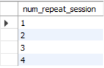
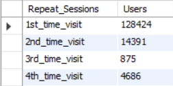
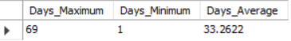
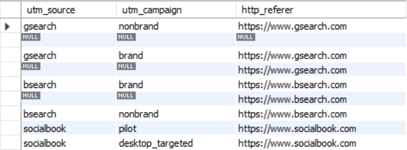
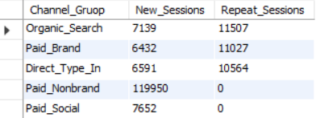
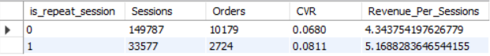

### User-Level Analysis

#### dentifying Repeat Visitiors
```sql
-- Identify number of repeat sessions
SELECT 
	DISTINCT num_repeat_session
FROM
(
    SELECT
        user_id,
        COUNT(is_repeat_session) AS num_repeat_session
    FROM website_sessions
    WHERE created_at BETWEEN '2014-01-01' AND '2014-11-01'
    GROUP BY 1
) TAB;
```


```sql
-- How many of our website visitors come back for another session in 2014
SELECT
    CASE 
		WHEN num_repeat_session = 1 THEN '1st_time_visit'
        WHEN num_repeat_session = 2 THEN '2nd_time_visit'
        WHEN num_repeat_session = 3 THEN '3rd_time_visit'
        WHEN num_repeat_session = 4 THEN '4th_time_visit'
    END AS Repeat_Sessions,
    COUNT(user_id) AS Users
FROM
(
    SELECT
        user_id,
        COUNT(is_repeat_session) AS num_repeat_session
    FROM website_sessions
    WHERE created_at BETWEEN '2014-01-01' AND '2014-11-01'
    GROUP BY 1
) TAB
GROUP BY 1;
```


#### Minimum, Maximum and Average time between the first and second session for customers who do come back
```sql
-- Find the first visit 
CREATE TEMPORARY TABLE First_Session 
SELECT 
	website_session_id AS fisrt_session_id,
	created_at AS first_session_created_at,
	user_id
FROM website_sessions
WHERE is_repeat_session = 0
	AND created_at BETWEEN '2014-01-01' AND '2014-11-03';

-- Get the repeat sessions using user_id
CREATE TEMPORARY TABLE From_First_To_Repeat_Sessions
SELECT	
	First_Session.fisrt_session_id,
	First_Session.first_session_created_at,
    website_sessions.website_session_id AS repeat_session_id,
    website_sessions.created_at AS repeat_session_created_at
FROM First_Session LEFT JOIN website_sessions
	ON website_sessions.user_id = First_Session.user_id
		AND website_sessions.website_session_id > First_Session.fisrt_session_id
        AND website_sessions.is_repeat_session = 1
WHERE website_sessions.created_at BETWEEN '2014-01-01' AND '2014-11-03';

-- Get the difference between days 
CREATE TEMPORARY TABLE AGG_DATA
SELECT 
	datediff(second_session_created_at,first_session_created_at) AS Day_Diff
FROM
(
	SELECT 
		fisrt_session_id,
		first_session_created_at,
		MIN(repeat_session_id) AS second_session_id,
		MIN(repeat_session_created_at) AS second_session_created_at
	FROM From_First_To_Repeat_Sessions
	WHERE repeat_session_id IS NOT NULL
	GROUP BY 1,2
) TAB;

-- Aggrgate data to get maximum, minimum and average days between first visit and second visit sessions
SELECT
	MAX(Day_Diff) AS Days_Maximum,
    MIN(Day_Diff) AS Days_Minimum,
    AVG(Day_Diff) Days_Average
FROM AGG_DATA;
```


#### New vs. Repeat Channels Patterns
```sql
-- Identify the channels that the customers are coming back through to figure out we still need to pay for paid channel or not
SELECT 
	DISTINCT utm_source, utm_campaign, http_referer
FROM website_sessions;
```


```sql
SELECT 
	CASE
		WHEN utm_source IN ('gsearch', 'bsearch') AND utm_campaign = 'nonbrand' THEN 'Paid_Nonbrand'
        WHEN utm_source IN ('gsearch', 'bsearch') AND utm_campaign = 'brand' THEN 'Paid_Brand'
        WHEN utm_source = 'socialbook' THEN 'Paid_Social'
        WHEN utm_campaign IS NULL AND http_referer IS NULL THEN 'Direct_Type_In'
        WHEN utm_campaign IS NULL AND http_referer IS NOT NULL THEN 'Organic_Search'
        ELSE NULL 
	END AS Channel_Gruop,
    COUNT(CASE WHEN is_repeat_session = 0 THEN website_session_id ELSE NULL END) AS New_Sessions,
    COUNT(CASE WHEN is_repeat_session = 1 THEN website_session_id ELSE NULL END) AS Repeat_Sessions
FROM website_sessions 
WHERE created_at BETWEEN '2014-01-01' AND '2014-11-05'
GROUP BY 1
ORDER BY 3 DESC;
```


Seems its look like when customers come back for repeat visits, they come from `Organic Search`, `Direct Type In` and `Paid Brand`

So, all in all we are not paying very much for these repeat visits


#### New vs. Repeat Visits Performance

```sql
SELECT 
	is_repeat_session,
    COUNT(DISTINCT website_sessions.website_session_id) AS Sessions,
    COUNT(DISTINCT orders.order_id) AS Orders,
    COUNT(DISTINCT orders.order_id) / COUNT(DISTINCT website_sessions.website_session_id) AS CVR,
    SUM(orders.price_usd) / COUNT(DISTINCT website_sessions.website_session_id) AS Revenue_Per_Sessions
FROM website_sessions LEFT JOIN orders 
	ON website_sessions.website_session_id = orders.website_session_id
WHERE website_sessions.created_at BETWEEN '2014-01-01' AND '2014-11-08'
GROUP BY 1;
```


The repeat visits are produce more revenue per session 


