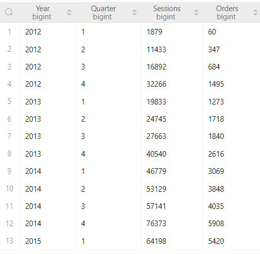
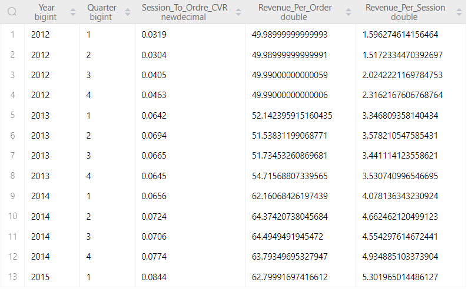
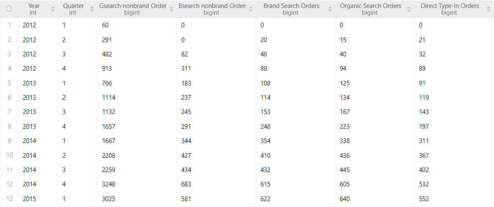
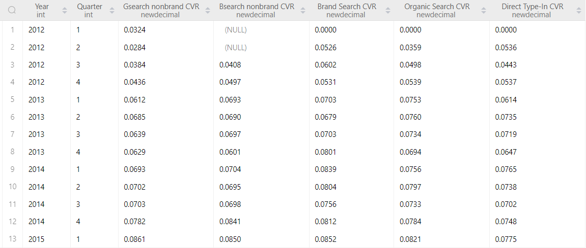
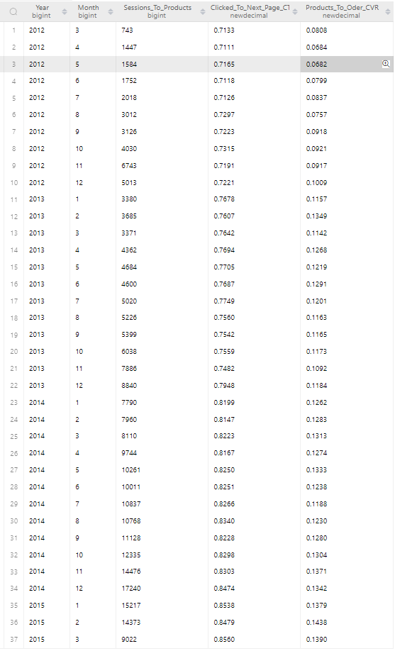

    1. First, I’d like to show our volume growth. Can you pull overall session and order volume,
    trended by quarter for the life of the business? Since the most recent quarter is incomplete, 
    you can decide how to handle it.

```sql
SELECT 
    YEAR(website_sessions.created_at) AS Year,
    QUARTER(website_sessions.created_at) AS Quarter,
    COUNT(DISTINCT website_sessions.website_session_id) AS Sessions,
    COUNT(DISTINCT orders.order_id) AS Orders
FROM website_sessions LEFT JOIN orders
    ON website_sessions.website_session_id = orders.website_session_id
GROUP BY 1,2
ORDER BY 1,2;
```


    2. Next, let’s showcase all of our efficiency improvements. I would love to show quarterly figures 
    since we launched, for session-to-order conversion rate, revenue per order, and revenue per session. 

```sql
SELECT 
    YEAR(website_sessions.created_at) AS Year,
    QUARTER(website_sessions.created_at) AS Quarter,
    COUNT(DISTINCT orders.order_id) / COUNT(DISTINCT website_sessions.website_session_id) AS Session_To_Ordre_CVR,
    SUM(orders.price_usd) / COUNT(DISTINCT orders.order_id) AS Revenue_Per_Order,
    SUM(orders.price_usd) / COUNT(DISTINCT website_sessions.website_session_id) AS Revenue_Per_Session
FROM website_sessions LEFT JOIN orders
    ON website_sessions.website_session_id = orders.website_session_id
GROUP BY 1,2
ORDER BY 1,2;
```




    3. I’d like to show how we’ve grown specific channels. Could you pull a quarterly view of orders 
    from Gsearch nonbrand, Bsearch nonbrand, brand search overall, organic search, and direct type-in?

```sql
SELECT  
    YEAR(website_sessions.created_at) AS Year,
    QUARTER(website_sessions.created_at) AS Quarter, 
    COUNT(CASE WHEN utm_source = 'gsearch' AND utm_campaign = 'nonbrand' THEN orders.order_id ELSE NULL END) AS 'Gsearch nonbrand Orders',
    COUNT(CASE WHEN utm_source = 'bsearch' AND utm_campaign = 'nonbrand' THEN orders.order_id ELSE NULL END) AS 'Bsearch nonbrand Orders',
    COUNT(CASE WHEN utm_source IN ('gsearch','bsearch') AND utm_campaign = 'brand' THEN orders.order_id ELSE NULL END) AS 'Brand Search Orders',
    COUNT(CASE WHEN utm_source IS NULL AND utm_campaign IS NULL AND http_referer IS NOT NULL THEN orders.order_id ELSE NULL END) AS 'Organic Search Orders',
    COUNT(CASE WHEN utm_source IS NULL AND utm_campaign IS NULL AND http_referer IS NULL THEN orders.order_id ELSE NULL END) AS 'Direct Type-In Orders'
FROM website_sessions LEFT JOIN orders 
    ON website_sessions.website_session_id = orders.website_session_id
GROUP BY 1,2
ORDER BY 1,2;
```



    4. Next, let’s show the overall session-to-order conversion rate trends for those same channels, 
    by quarter. Please also make a note of any periods where we made major improvements or optimizations.

```sql
SELECT  
    YEAR(website_sessions.created_at) AS Year,
    QUARTER(website_sessions.created_at) AS Quarter, 
    COUNT(CASE WHEN utm_source = 'gsearch' AND utm_campaign = 'nonbrand' THEN orders.order_id ELSE NULL END)
    / COUNT(CASE WHEN utm_source = 'gsearch' AND utm_campaign = 'nonbrand' THEN website_sessions.website_session_id ELSE NULL END) AS 'Gsearch nonbrand CVR',
    COUNT(CASE WHEN utm_source = 'bsearch' AND utm_campaign = 'nonbrand' THEN orders.order_id ELSE NULL END)
    / COUNT(CASE WHEN utm_source = 'bsearch' AND utm_campaign = 'nonbrand' THEN website_sessions.website_session_id ELSE NULL END) AS 'Bsearch nonbrand CVR',
    COUNT(CASE WHEN utm_source IN ('gsearch','bsearch') AND utm_campaign = 'brand' THEN orders.order_id ELSE NULL END)
    / COUNT(CASE WHEN utm_source IN ('gsearch','bsearch') AND utm_campaign = 'brand' THEN website_sessions.website_session_id ELSE NULL END) AS 'Brand Search CVR',
    COUNT(CASE WHEN utm_source IS NULL AND utm_campaign IS NULL AND http_referer IS NOT NULL THEN orders.order_id ELSE NULL END)
    / COUNT(CASE WHEN utm_source IS NULL AND utm_campaign IS NULL AND http_referer IS NOT NULL THEN website_sessions.website_session_id ELSE NULL END) AS 'Organic Search CVR',
    COUNT(CASE WHEN utm_source IS NULL AND utm_campaign IS NULL AND http_referer IS NULL THEN orders.order_id ELSE NULL END) 
    / COUNT(CASE WHEN utm_source IS NULL AND utm_campaign IS NULL AND http_referer IS NULL THEN website_sessions.website_session_id ELSE NULL END)  AS 'Direct Type-In CVR'
FROM website_sessions LEFT JOIN orders 
    ON website_sessions.website_session_id = orders.website_session_id
GROUP BY 1,2
ORDER BY 1,2;
```
 
 

    5. We’ve come a long way since the days of selling a single product. Let’s pull monthly trending for revenue 
    and margin by product, along with total sales and revenue. Note anything you notice about seasonality.

```sql
SELECT * FROM products;
 -- Products >>> {1:The Original Mr. Fuzzy, 2:The Forever Love Bear, 3:The Birthday Sugar Panda, 4:The Hudson River Mini bear}
SELECT 
    YEAR(orders.created_at) AS Year,
    MONTH(orders.created_at) AS Month,
    COUNT(DISTINCT order_id) AS Sales,
    ROUND(SUM(price_usd),2) AS Total_Revenue,
    ROUND(SUM(CASE WHEN primary_product_id = 1 THEN price_usd ELSE NULL END ),2) AS 'Mr-Fuzzy Revenue',
    ROUND(SUM(CASE WHEN primary_product_id = 1 THEN price_usd - cogs_usd ELSE NULL END ),2) AS 'Mr-Fuzzy Margin',
    ROUND(SUM(CASE WHEN primary_product_id = 2 THEN price_usd ELSE NULL END ),2) AS 'Love Bear Revenue',
    ROUND(SUM(CASE WHEN primary_product_id = 2 THEN price_usd - cogs_usd ELSE NULL END ),2) AS 'Love Bear Margin',
    ROUND(SUM(CASE WHEN primary_product_id = 3 THEN price_usd ELSE NULL END ),2) AS 'Sugar Panda Revenue',
    ROUND(SUM(CASE WHEN primary_product_id = 3 THEN price_usd - cogs_usd ELSE NULL END ),2) AS 'Sugar Panda Margin',
    ROUND(SUM(CASE WHEN primary_product_id = 4 THEN price_usd ELSE NULL END ),2) AS 'Mini bear Revenue',
    ROUND(SUM(CASE WHEN primary_product_id = 4 THEN price_usd - cogs_usd ELSE NULL END ),2) AS 'Mini bear Margin'
FROM orders 
GROUP BY 1,2;
```


    6. Let’s dive deeper into the impact of introducing new products. Please pull monthly sessions to 
    the /products page, and show how the % of those sessions clicking through another page has changed 
    over time, along with a view of how conversion from /products to placing an order has improved.

```sql
-- Identify the relevant sessions related the `/prducts` page
CREATE TEMPORARY TABLE Products_Page
SELECT 
    website_session_id,
    website_pageview_id,
    created_at AS saw_product_page
FROM website_page_views
WHERE pageview_url = '/products';

SELECT
    YEAR(saw_product_page) AS Year,
    MONTH(saw_product_page) AS Month,
    COUNT(DISTINCT Products_Page.website_session_id) AS Sessions_To_Products,
    COUNT(DISTINCT website_page_views.website_session_id) / COUNT(DISTINCT Products_Page.website_session_id) AS Clicked_To_Next_Page_CTR,
    COUNT(DISTINCT orders.order_id) / COUNT(DISTINCT Products_Page.website_session_id) AS Products_To_Oder_CVR
FROM Products_Page LEFT JOIN website_page_views 
    ON Products_Page.website_session_id = website_page_views.website_session_id
        AND website_page_views.website_pageview_id > Products_Page.website_pageview_id
    LEFT JOIN orders 
        ON Products_Page.website_session_id = orders.website_session_id
GROUP BY 1,2
ORDER BY 1,2;
```



    7. We made our 4th product available as a primary product on December 05, 2014 (it was previously only a cross-sell item). 
    Could you please pull sales data since then, and show how well each product cross-sells from one another?

```sql
SELECT 
    O.primary_product_id,
    COUNT(DISTINCT O.order_id) AS Orders,
    COUNT(CASE WHEN I.product_id = 1 THEN O.order_id ELSE NULL END) AS Cross_Sell_P1,
    COUNT(CASE WHEN I.product_id = 1 THEN O.order_id ELSE NULL END) / COUNT(DISTINCT O.order_id) AS Cross_Sell_P1_Rate,
    COUNT(CASE WHEN I.product_id = 2 THEN O.order_id ELSE NULL END) AS Cross_Sell_P2,
    COUNT(CASE WHEN I.product_id = 2 THEN O.order_id ELSE NULL END) / COUNT(DISTINCT O.order_id) AS Cross_Sell_P2_Rate,
    COUNT(CASE WHEN I.product_id = 3 THEN O.order_id ELSE NULL END) AS Cross_Sell_P3,
    COUNT(CASE WHEN I.product_id = 3 THEN O.order_id ELSE NULL END) / COUNT(DISTINCT O.order_id) AS Cross_Sell_P3_Rate,
    COUNT(CASE WHEN I.product_id = 4 THEN O.order_id ELSE NULL END) AS Cross_Sell_P4,
    COUNT(CASE WHEN I.product_id = 4 THEN O.order_id ELSE NULL END) / COUNT(DISTINCT O.order_id) AS Cross_Sell_P4_Rate
FROM orders O LEFT JOIN order_items I
    ON O.order_id = I.order_id
    AND I.is_primary_item = 0 -- Cross Sell
WHERE O.created_at > '2014-12-05'
GROUP BY 1;
```


