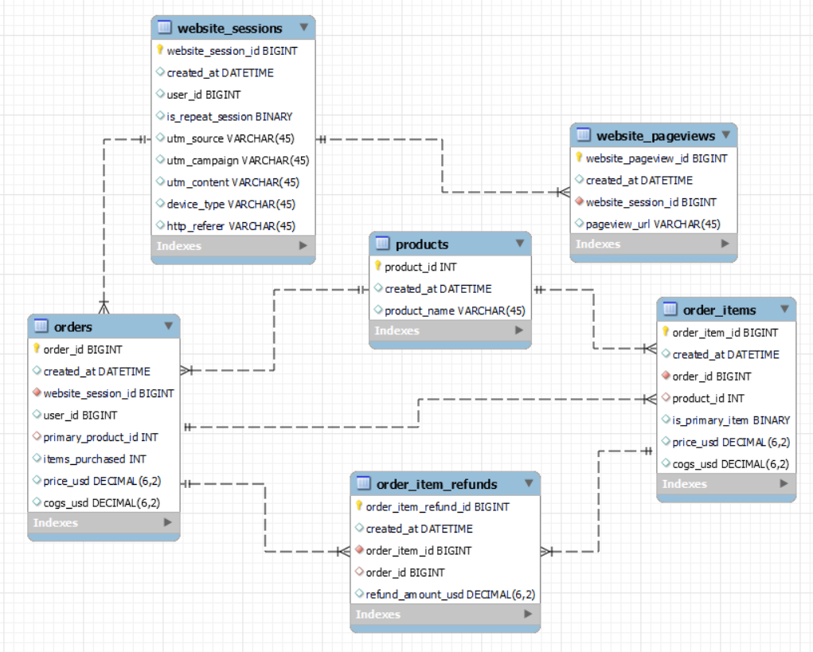

# Maven-Factory-Analytics
Maven Fuzzy Factory Data analysis using MySQL and visualize by Tableau.

#### Introduction

I worked as an eCommerce Database Analyst for Maven Fuzzy Factory, a new online retailer that had just launched its first product. I collaborated with the CEO, Marketing Manager, and Website Manager to analyze and optimize marketing channels, measure and test website conversion performance, and explore the product portfolio to understand the impact of new product launches in order to help the business make better decisions.

#### Entity Relation Diagram

Working with **six related tables**, which contain **eCommerce** data about:

    Website Activity
    Products
    Orders and Refunds

**Six tables are:**

**Orders:** Store the purchases that customers are placing.

**Order_items:** Various orders that customers could purchases more than items.

**Order_item_refunds:** When customers are complaining and are issued a refund.

**Products:** Products name.

**Website_page_views:** Log of page view that a user saw when they were on eCommerce website.

**Website_sessions:** Where our traffic is coming from and traffic sources.

**Before jumping into the project, I would like to briefly cover some web/digital marketing buzzwords :-**
    
    UTM parameters: Are small pieces of code that are added to the end of a URL used to track the source of the traffic
    
    By tracking them, businesses can see which of their paid marketing campaigns are most effective.They can also see how different traffic sources and 
    campaigns are performing in terms of website activity and conversions.

     ------------- ------------------------------------------------------------------------- -------------------------
    | utm_source  | Identifies which site sent the traffic and is a required parameter.     | utm_source=google       |
    | ------------| ----------------------------------------------------------------------- | ------------------------|
    | utm_campaign| Identifies a specific product promotion or strategic campaign.          | utm_campaign=spring_sale|
    | ------------|-------------------------------------------------------------------------|-------------------------|
    | utm_content | Identifies what specifically was clicked to bring the user to the site, | utm_content=logolink or |
    |             |  such as a banner ad or a text link. It is often used for A/B testing   | utm_content=textlink    |
    |             | and content-targeted ads.                                               |                         |
     ------------- ------------------------------------------------------------------------- -------------------------  

#### Contents:
    Traffic Sources Analysis
    Website Performance Analysis
    Channel Portfolio Management
    Business Patterns and Seasonality
    Product-Level Analysis
    User-Level Analysis
    Data Driven Report

#### Traffic Sources Analysis

**Key Tables :**    website_sessions, orders

*   Find the Top Traffic Sources
*   Traffic Source Conversion Rates
*   Bid optimization based on the device type

#### Website Performance Analysis

**Key Tables :**    website_sessions, website_pageviews

*   Analyzing Top Referral Sources & Website Pages & Entry Pages
*   Analyzing Bounce Rates 
*   Building Conversion Funnels 

#### Channel Portfolio Management

**Key Tables :**    website_sessions, orders  

*   Analyzing Channel Portfolio
*   Comparing Channel Characteristics
*   Cross Channel Bid Optimization
*   Impact of Bid Changes
*   Analyzing Free Channels

#### Business Patterns and Seasonality

**Key Tables :**    website_sessions, orders

*   Analyzing Seasonality
*   Analyzing Business Patterns

#### Product-Level Analysis

**Key Tables :**    website_sessions, website_pageviews, orders, order_items, order_item_refunds

*   Product Sales Analysis
*   Product Launch Sales Analysis
*   Product Level Website Analysis
*   Product Pathing Analysis
*   Product Conversion Funnel
*   Cross Sale Analysis
*   Portfolio Expansion Analysis
*   Quailty issues & Refunds

#### User-Level Analysis

**Key Tables :**    website_sessions, orders

*   Analyzing Users Repeat Visit
*   Analyzing Purchase Behavior (Repeat Channel, New & Repeat Conversion Rates)

#### Data Driven Report

**Key Tables :**    website_sessions, website_pageviews, orders, order_items

<a href='https://public.tableau.com/views/MavenFuzzyFactory-TrafficSourceAnalysis/Dashboard2?:language=en-US&:display_count=n&:origin=viz_share_link'> Traffic Source Insight </a>

<a href='https://public.tableau.com/views/MavenFuzzyFactory-Products/Products?:language=en-US&:display_count=n&:origin=viz_share_link'> Products Insight </a>

<a href='https://public.tableau.com/views/MavenFuzzyFactory_17038676847260/SessionsVS_Orders?:language=en-US&:display_count=n&:origin=viz_share_link'> Sessions and Orders </a>

**Observation:**

At the end of three years run of the businss, we can see pretty dramatic growth. When we look in the first quarter and now at about 100 times orders  

<a href='https://public.tableau.com/views/MavenFuzzyFactory4/RevenueVS_Margin?:language=en-US&:display_count=n&:origin=viz_share_link'> Revenue and Margin </a>

**Observation:**

Revenue and Margin tends to increase gradually from 2012 to 2015

The company usually has the highest revenue and profit in the last quarters of a year

<a href='https://public.tableau.com/views/MavenFuzzyFactory2/CVRRevenuePerSessionandOrder?:language=en-US&:display_count=n&:origin=viz_share_link'> Session-to-Order Conversion rate, Revenue Per Session, and Revenue Per Order </a>

 & CVR.png>)

**Observation:**

Volume of Website sessions and orders tend to increase gradually from 2012 to 2015

Conversion rates typically range from about 0.03 to 0.9, which is between 3% and 9% of sessions converted into orders. This ratio is considered good and acceptable throughout the observation range