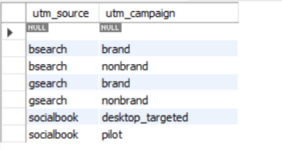
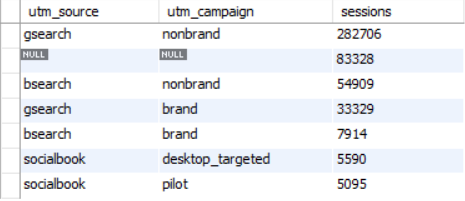
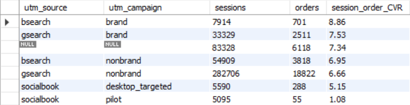
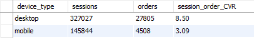
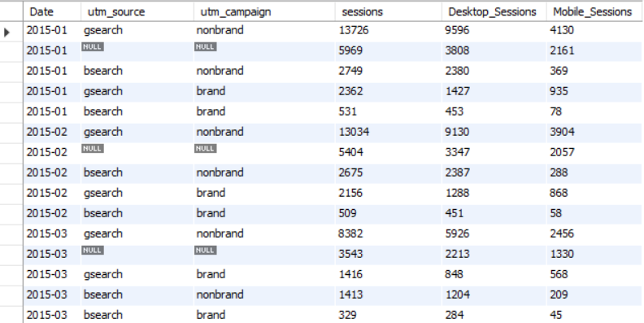

### Traffic source analysis

	Identifying the most useful traffic channels, campaigns, and keywords with strongest conversation rates

**Key tables:** website_sessions and orders

#### Where are our customers coming from, and which specific campaign is driving the traffic
```SQL
select distinct utm_source, utm_campaign from website_sessions
order by 1;
```



#### Identify the major of traffic sources
```SQL
select utm_source, utm_campaign, count(distinct website_session_id) as sessions 
from website_sessions 
group by 1,2
order by sessions desc;
```


The company's major traffic sources are `gsearch` utm_source and `nonbrand` utm_campaign.The **second highest traffic** to the website is through `organic and direct search without any paid campaigns`.

#### Conversions rate occurred for each traffic source or campaign.

```SQL
select 
	ws.utm_source,
	ws.utm_campaign,
    count(distinct ws.website_session_id) as sessions ,
    count(distinct o.order_id) as orders,
    round(count(distinct o.order_id) / count(distinct ws.website_session_id)*100.0,2) as session_order_CVR
from website_sessions ws left join orders o on ws.website_session_id = o.website_session_id
group by 1,2
order by session_order_CVR desc;
```


`Bsearch` utm_source with `brand` utm_campaign has the **most session** to order conversation rate of 8.86% followed by `gsearch` – `brand` and `organic/direct` search. `Socialbook`-desktop_targeted and socialbook-pilot has the **lowest**. Hence it might be a good idea to decrease the budget for those campaigns and allocate it to others.

#### Bid optimization based on the device type

```SQL
select 
	ws.device_type,
    count(distinct ws.website_session_id) as sessions ,
    count(distinct o.order_id) as orders,
    round(count(distinct o.order_id) / count(distinct ws.website_session_id)*100.0,2) as session_order_CVR
from website_sessions ws left join orders o on ws.website_session_id = o.website_session_id
group by 1
order by session_order_CVR desc;
```


#### website traffic patterns at last three months to understand when users are most active and where they are coming from

```SQL
select 
	date_format(created_at, '%Y-%m') as Date,
    utm_source,
    utm_campaign,
    count(distinct website_session_id) as sessions,
	count(case when device_type = 'desktop' then website_session_id else null end) as Desktop_Sessions,
    count(case when device_type = 'mobile' then website_session_id else null end) as Mobile_Sessions
from website_sessions
 where year(created_at) = 2015
 group by 1,2,3
 order by 1 asc, 4 desc;
```

